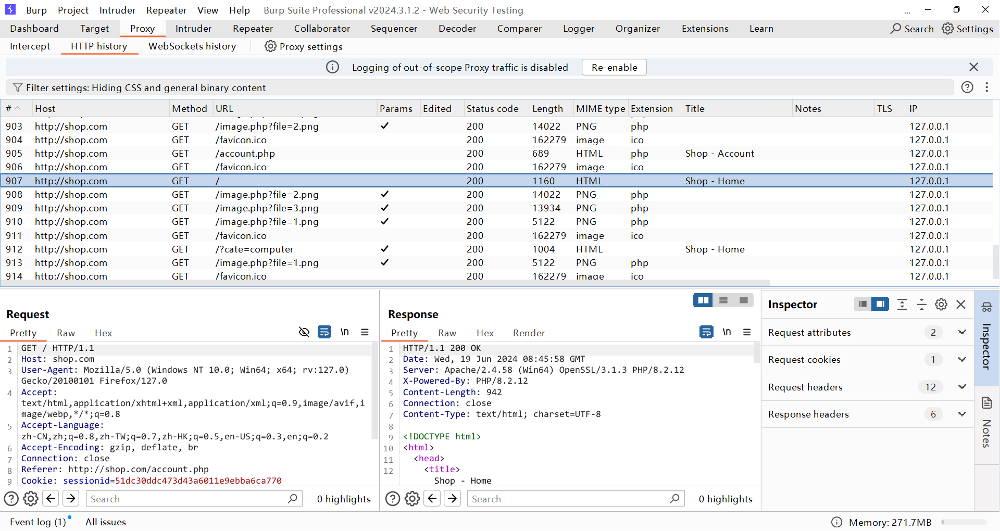

# Burp Suite 网站渗透测试

## 课程介绍

Burp Suite Professional 是一款 Web 渗透测试工具，功能强大，但入门相对较难。本课程以研究六种常见Web漏洞的方式，带大家入门 Burp Suite Professional。

本课程涉及的Web漏洞有：
- 暴力破解
- 跨站脚本攻击 XSS
- 文件上传漏洞
- 路径穿越
- 跨站请求伪造 CSRF
- SQL注入

本课程涉及的Burp模块有：
- Proxy
- Intruder
- Repeater
- Collaborator
- Scanner

## 相关截图

